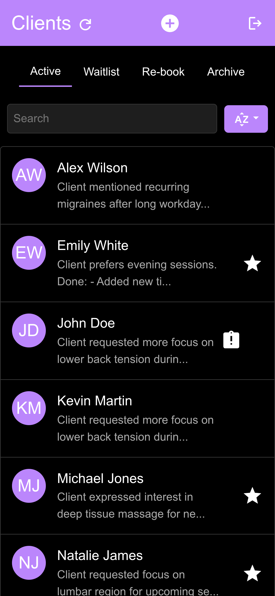
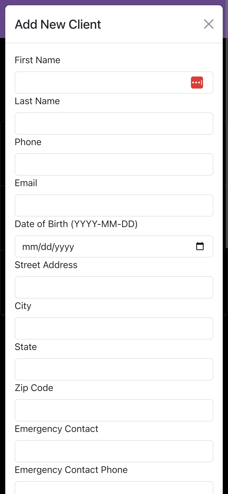
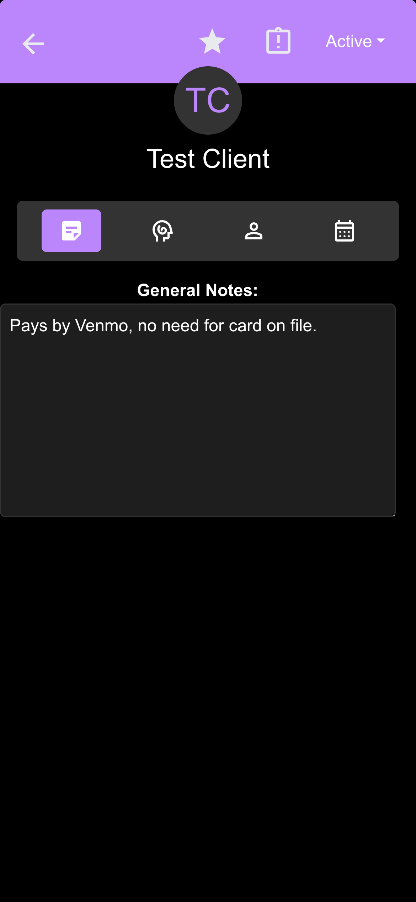
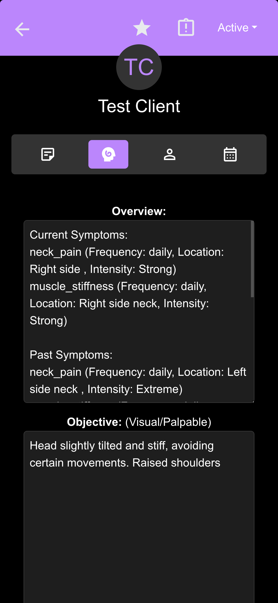
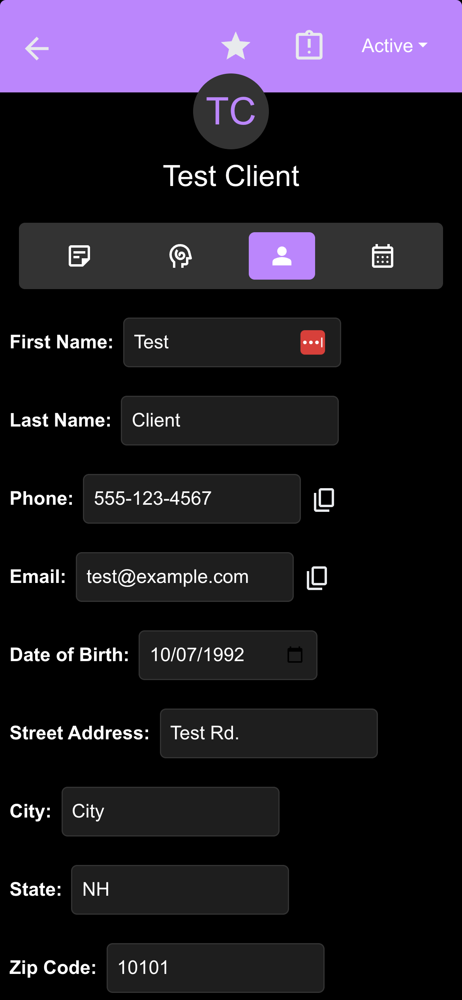

# Client Management App for Alton Therapeutic Massage

## Description

This web application is designed to help massage therapists manage and track client information. The app allows users to store and organize client details such as contact information, appointment history, symptoms, treatment objectives, and plans.

## Features

**(The information in the following screenshots is not real and is only for demonstration purposes.)**

- **Home Page**:

<!--  -->

  
  

- Organizes clients into four tabs based on their status:
  - **Active**
  - **Waitlist**
  - **Re-book**
  - **Archived**
- Each client is displayed with their name and a short general notes description.
- Includes a **search bar** to quickly find clients and a **filter** option to sort clients by:
  - Name
  - List queue
  - Recently modified
- **Plus button** allows the addition of new clients to the system.

- **Client Info Page**:
  

    
    
    
  

  - Used for updating all client information. Clients can fill out a form on Alton Therapeutic Massage's website. Submitting this form creates a profile within the app that defaults to the waitlist section.
  - The top bar contains:
    - A **status dropdown** to change the client's status.
    - **Favorite toggle**: Mark the client as a favorite.
    - **Important notes toggle**: Highlight clients with important notes to be reviewed before an appointment.
  - Four tabs for organizing client details:
    - **General Notes**: Free-form notes for capturing general client information.
    - **SOAP Notes**: Structured notes following the SOAP format (Subjective, Objective, Assessment, Plan), which is a standardized method of documenting client interactions in healthcare:
      - **Subjective**: Client's description of their symptoms and experiences. (Titled Overview in the app)
      - **Objective**: Observable facts and clinical findings.
      - **Assessment**: Professional conclusions and diagnosis.
      - **Plan**: Recommended treatment and steps for future care.
    - **Profile**: Client contact information and demographic details.
    - **Rebook Page**: Notes for rebooking

## Technologies Used

- **React**: Front-end development
- **AWS**:
  - **AWS Amplify**: A service for hosting the frontend, as well as organizing backend services.
  - **Amazon Cognito**: For secure user authentication and authorization.
  - **AWS Lambda**: To handle serverless API operations and backend logic.
  - **Amazon API Gateway**: For creating and managing APIs to communicate between the frontend and backend.
  - **Amazon RDS** (PostgreSQL): For client and appointment data storage, encrypted to comply with HIPAA regulations for storing personal health information.

## TODO

- Incorporate Tailwind css into styling (improve styling, add transitions, etc)
